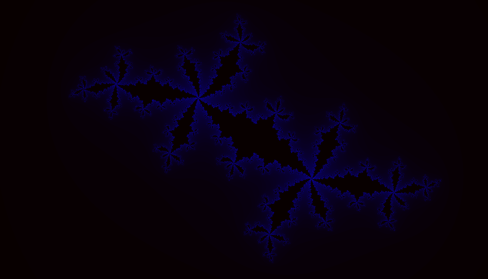

## Fractals

This project is a Fractal Visualizer made using [ThreeShaderCanvas](https://github.com/Marco4413/ThreeShaderCanvas)

### Keybinds

 - Change Fractal: Press ArrowUp / ArrowDown
 - Toggle Julia Set: Press J
 - Change Julia Set Coordinates: Move the Mouse while holding CTRL
 - Zooming: Mouse Wheel / + / -
 - Move Camera: Left-Click and Drag the Mouse / WASD (Hold Shift to move faster)
